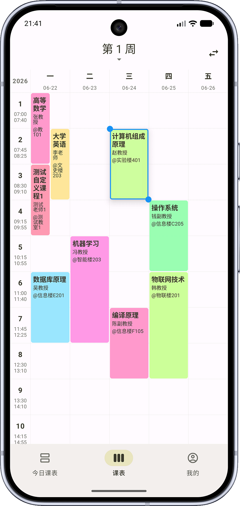
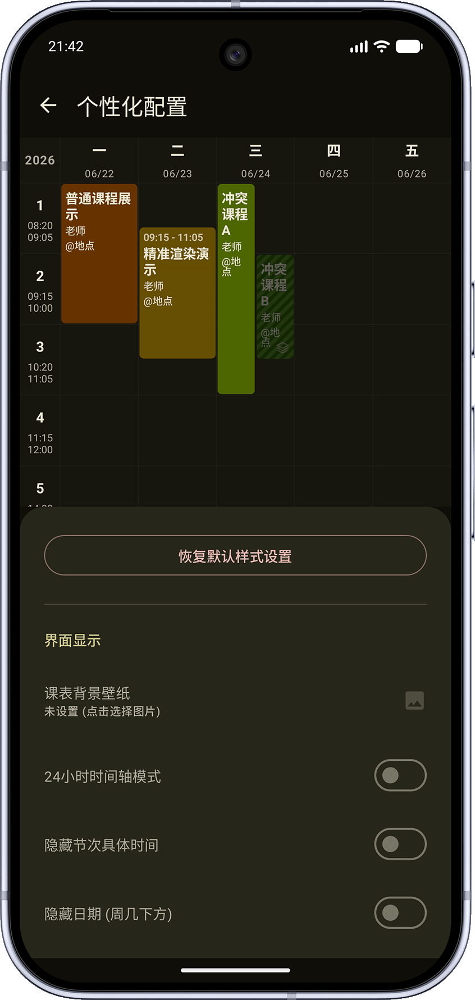
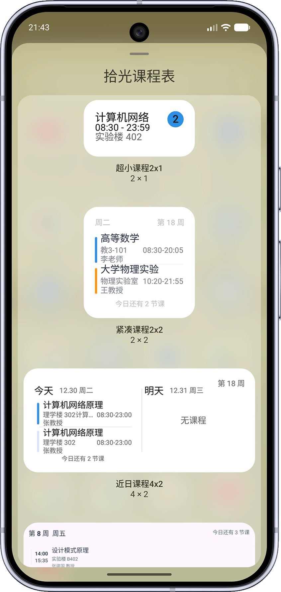

# 南信拾光

面向南京信息工程大学（NUIST）的课程表与校园信息工具。
本项目基于[拾光课程表](https://github.com/XingHeYuZhuan/shiguangschedule)进行二次开发，针对 NUIST 教务系统和统一门户进行了适配。

> 本项目为社区维护的非官方项目，与南京信息工程大学及其官方信息系统没有隶属或授权关系。

## 项目状态

- 当前仅支持 Android，项目目录和构建入口已按 Android 端整理。
- 课程表、课程管理、提醒、小组件和数据导入导出能力来自上游项目并持续维护。
- 已加入 NUIST 教务导入、成绩中心、学业概览、统一门户绑定和宿舍电费查询等功能。
- 成绩、学业概览和电费功能依赖学校服务器、登录状态及接口可用性；学校服务不可用时，相关功能可能无法加载。

## 项目结构

- `app/`：唯一 Android 应用模块。
- `app/src/main/`：AndroidManifest、Android 资源和 assets。
- `app/src/commonMain/`：业务逻辑、Compose 页面、资源和 proto。
- `app/src/androidMain/`：Android 平台实现和系统集成。
- `app/src/commonTest/`：业务逻辑测试。
- `app/assets/`：离线教务适配资源，由 Gradle 打包进 Compose Resources。
- `app/schemas/`：Room 数据库 schema。
- `docs/images/`：README 和项目文档使用的截图与展示素材。
- `fastlane/metadata/`：Android 发布商店元数据。
- `gradle/`：Gradle Wrapper 与版本目录。

应用只保留 `app` 模块。源码暂沿用 Kotlin Multiplatform 的源集组织，但只配置 Android target；包名、applicationId 和 Compose 资源包名已统一为南信拾光专版标识。

本专版使用新的 applicationId `com.wild0408.nanxinshiguang`，与旧版安装包视为不同应用。项目仓库：[wild0408/nanxinshiguang](https://github.com/wild0408/nanxinshiguang)。

## 主要功能

### 课程表

- 今日课表和周课表
- 多课表与作息方案管理
- 课程增删改、周次调整和课程颜色设置
- 深色模式、主题和课表布局自定义
- 课程提醒、勿扰模式和 Android 小组件

### NUIST 教务适配

- 通过 NUIST 教务系统导入课程
- 支持当前学期课程数据处理
- 支持 NUIST 成绩数据导入和本地保存
- 成绩中心按学期查看课程、成绩、学分和成绩点

### 学业与校园服务

- 学业概览卡片：平均绩点、GPA、平均成绩等指标
- 成绩查询详情页
- 统一门户账号绑定
- 宿舍电费查询与历史趋势

### 数据能力

- JSON 课表导入和导出
- ICS 日历导出
- WebDAV 备份与同步
- 本地数据库和设置持久化

## 项目预览

| 周课表 | 课表个性化配置 | Android 小组件 |
| :---: | :---: | :---: |
|  |  |  |

## 构建

需要安装 Android Studio、JDK 21 和 Android SDK。

```powershell
./gradlew.bat :app:assembleDebug
```

生成的 Android APK 位于：

```text
app/build/outputs/apk/
```

应用模块测试：

```powershell
./gradlew.bat :app:testDebugUnitTest
```

## 开源来源与许可证

本项目是拾光课程表的派生项目。上游项目及本项目的主要代码使用 Apache License 2.0，许可证文本见 [`LICENSE`](LICENSE)。

- 上游主仓库：[XingHeYuZhuan/shiguangschedule](https://github.com/XingHeYuZhuan/shiguangschedule)
- 上游教务适配仓库：[XingHeYuZhuan/shiguang_warehouse](https://github.com/XingHeYuZhuan/shiguang_warehouse)
- 上游适配说明：[项目 Wiki](https://github.com/XingHeYuZhuan/shiguangschedule/wiki)

重新分发本项目或其衍生版本时，请保留 Apache-2.0 许可证、原作者版权和归属声明，并在修改文件中说明修改内容。项目中使用的第三方依赖许可证可在应用内“开源许可证”页面查看。

## 隐私与安全

- 账号凭据仅用于访问用户主动使用的学校服务。
- 成绩、课表和电费数据主要保存在本地设备。
- 请勿提交真实账号、密码、通行密钥、Cookie、Token 或个人成绩数据。
- 使用学校统一门户和教务系统时，请遵守学校信息系统的使用规则。

## 参与开发

欢迎提交 Issue、功能建议和代码改进。提交代码前请确认：

1. 不包含真实账号、密码、Cookie、Token 或个人信息。
2. 新增的第三方代码具有明确许可证，并保留必要的版权和归属信息。
3. NUIST 接口相关改动经过脱敏，且不会绕过学校系统的安全校验。
4. 提交前完成必要的构建和测试。

## 免责声明

本项目按现状提供，不保证学校接口持续可用，也不保证教务系统、统一门户或电费系统的响应格式长期不变。使用本项目产生的账号、数据和系统风险由使用者自行承担。
