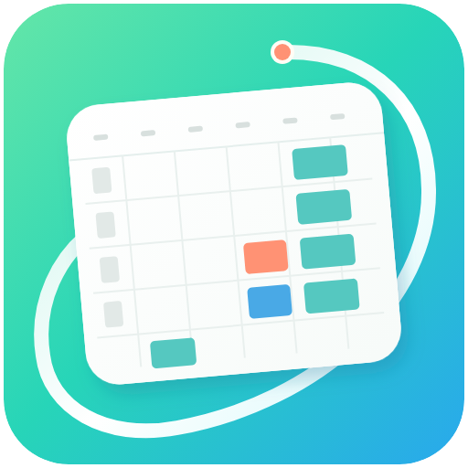
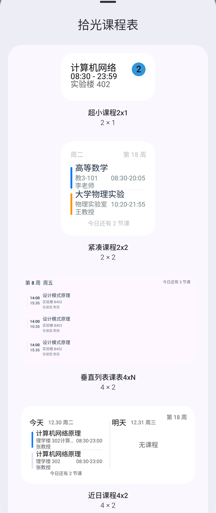

# 南信拾光



面向**南京信息工程大学（NUIST）**的课程表与校园信息工具，仅支持 Android。

本项目基于[拾光课程表](https://github.com/ShiGuangSchedule/shiguangschedule)二次开发，在保留其课程表能力的基础上，针对 NUIST 教务系统与统一门户做了深度适配，并按双 UI 体系重构了视图层。

> 本项目为社区维护的非官方项目，与南京信息工程大学及其官方信息系统没有隶属或授权关系。

[](https://github.com/wild0408/nanxinshiguang/releases)
[](LICENSE)


---

## 简介

- **课程表**：周课表与今日课表、多课表与作息方案、课程增删改与配色、课程提醒、桌面小组件。
- **NUIST 教务与服务**：教务系统导入课程与成绩、成绩中心、学业概览、统一门户绑定、劳动积分、宿舍电费与趋势、校园公交实时地图。
- **两套界面风格**：Material 3 与 Miuix（HyperOS 风格）可切换，共用同一份 ViewModel 与业务逻辑。
- **本地优先**：课表、成绩、电费与设置主要保存在本机；门户通行密钥可导出为口令加密文件，换机后直接导入复用。
- **开源**：Apache License 2.0，来源与修改声明见 [`NOTICE`](NOTICE)。

当前版本 **1.0.8（versionCode 9）**，要求 Android 8.0（API 26）及以上，提供 `arm64-v8a`、`armeabi-v7a`、`x86_64` 三个 ABI 的独立 APK。

---

## 功能

### 课程表

- 今日课表与周课表展示，多课表与作息方案管理
- 课程增删改、周次调整与课程颜色自定义
- 深色模式、配色主题与课表布局个性化
- 课程提醒、勿扰模式与 Android 桌面小组件

### NUIST 教务适配

- 通过 NUIST 教务系统 Web 导入课程数据，支持当前学期课程处理
- 支持 NUIST 成绩导入与本地持久化，成绩中心默认显示当前学期，可切换学期并查看课程成绩详情

### 学业与校园服务

- 学业概览卡片：平均绩点、GPA、平均成绩等指标
- 劳动积分总览与详情：总积分、理论劳动、生活劳动、服务劳动、专业劳动、竞赛积分及确认/归档状态
- 劳动积分区分官方核算结果与活动页实时累计数据，实时数据可能早于官方核算，详情页分别标注来源
- 统一门户账号绑定；宿舍电费查询与历史趋势图表
- 校园公交：校园底图、站点与公交车辆实时位置，支持缩放拖拽与手动刷新（数据依赖校园公交平台接口）

### 数据与备份

- JSON 课表导入导出、ICS 日历导出与系统日历同步、WebDAV 备份与恢复
- 成绩写入本地 Room 数据库，重启后仍可查看；学业概览与劳动积分使用加密 DataStore 缓存
- 查询失败时优先保留已有数据并在页面内提示；未绑定账号、暂无数据与服务异常分别提供对应入口

### 界面风格

- **Material 3**：`ui/material/<domain>`
- **Miuix（HyperOS 风格）**：`ui/miuix/<domain>`，使用 Miuix 组件与主题

两套界面共享 `ui/viewmodel/<domain>` 下的同一套状态与逻辑，切换风格不影响数据。

---

## 界面素材

<p>
  
  &nbsp;&nbsp;
  
</p>

<p>
  
  <br>
  <sub>小组件形态示意（素材取自上游项目）</sub>
</p>

图标设计稿为 [`docs/images/icon.svg`](docs/images/icon.svg)，全套启动图标（旧式方形、自适应背景/前景、Android 13+ 主题图标）由 [`tools/generate_launcher_icons.py`](tools/generate_launcher_icons.py) 一键生成。

---

## 下载与安装

前往 [Releases](https://github.com/wild0408/nanxinshiguang/releases) 下载与设备 ABI 对应的 APK（无法确定时优先选 `arm64-v8a`）。

```powershell
adb install -r nanxinshiguang-v1.0.8-arm64-v8a-release.apk
```

- `-r` 仅适用于同包名且签名兼容的已安装版本。Debug 与 Release 使用不同证书，不能互相覆盖；如需切换签名，先评估并备份应用数据，**不要为了安装而直接卸载现有应用**。
- 旧版拾光课程表与本项目的 applicationId 不同，可分别安装。
- 本项目 Release 使用的证书 SHA-256 指纹：

```text
C6:23:57:85:44:DF:D6:12:2E:8C:37:1E:D4:55:5A:CF:90:41:1A:FD:C0:4B:92:67:CC:D7:91:6B:76:3B:AA:3D
```

安装或分发前可用 Android SDK 的 `apksigner verify --print-certs` 核对指纹。

---

## 构建与测试

需要 **JDK 21** 与 **Android SDK**（compileSdk 37 / minSdk 26）。可用 Android Studio，或直接使用 Gradle Wrapper。

```powershell
# 调试构建
./gradlew.bat :app:assembleDebug --no-daemon --console=plain

# 单元测试
./gradlew.bat :app:testDebugUnitTest --no-daemon --console=plain

# 仪器测试（需要已连接的设备或模拟器）
./gradlew.bat :app:connectedDebugAndroidTest --no-daemon --console=plain
```

APK 按 ABI 分别输出到 `app/build/outputs/apk/debug/` 与 `app/build/outputs/apk/release/`，不提供通用 APK。

### Release 签名

本地 Release 构建需要在当前进程提供以下环境变量，缺失时签名配置不生效：

| 环境变量 | 内容 |
|---|---|
| `NANXINSHIGUANG_KEYSTORE_FILE` | 密钥库文件的绝对路径 |
| `NANXINSHIGUANG_KEYSTORE_PASSWORD` | 密钥库密码 |
| `NANXINSHIGUANG_KEY_ALIAS` | `nanxinshiguang` |
| `NANXINSHIGUANG_KEY_PASSWORD` | 私钥密码 |

```powershell
./gradlew.bat :app:assembleRelease --no-configuration-cache
```

不要把密钥库、密码或带密码的 Gradle 参数写入仓库与构建日志，也不要硬编码在脚本中；密钥库与可恢复的密码应分别离线备份。

---

## 技术栈与架构

| 方面 | 选型 |
|---|---|
| 语言与构建 | Kotlin 2.4.0、AGP 9.3.1、Gradle 版本目录（`gradle/libs.versions.toml`） |
| UI | Compose Multiplatform 1.11.1、Compose Material 3、Miuix 0.9.4 |
| 架构 | ViewModel + UiState，双 UI 层共用业务层 |
| 依赖注入 | Koin 4.2.2（注解 + 编译器插件） |
| 持久化 | Room 3、DataStore、`app/schemas/` 下的迁移文件 |
| 网络与协议 | Ktor 3.5.2（CIO）、Wire 6.4.5、kotlinx.serialization |
| 系统集成 | WorkManager、精确闹钟、桌面小组件、无障碍与通知 |

工程为单模块多源集结构：

- `app/src/main/`：`AndroidManifest.xml`、Android 原生资源与 assets
- `app/src/commonMain/`：跨平台业务逻辑、Proto 协议、共享 ViewModel/UiState 与 Material 3 界面
- `app/src/androidMain/`：平台实现、系统组件集成（小组件、通知 Worker、精确闹钟）与 Miuix/HyperOS 视觉组件
- `app/src/commonTest/`、`app/src/androidUnitTest/`、`app/src/androidTest/`：单元测试与仪器测试
- `app/schemas/`：Room schema 迁移文件
- `tools/`：图标生成、更新日志生成等维护脚本
- `docs/images/`：文档展示素材；`fastlane/metadata/`：发布元数据

---

## 发布与维护

- **版本号**：`versionCode` 单调递增，`versionName` 采用 `主版本.次版本.修订号`，在 `app/build.gradle.kts` 中维护。
- **发布日志**：每个版本在 `fastlane/metadata/android/<locale>/changelogs/<versionCode>.txt` 提供更新说明，同时在 GitHub Releases 填写发布说明。
- **GitHub Actions**：
  - `Android CI Build`（手动触发）：使用 `Release-Signing` 环境中的 `KEYSTORE_BASE64`、`KEYSTORE_PASSWORD`、`KEY_ALIAS`、`KEY_PASSWORD` Secrets 构建签名 Release，产物可下载。
  - `需要审核的发布操作`（手动触发）：先展示发布参数供确认，再经 `Production-Release` 环境审批后发布到 GitHub Releases。
  - `Check PR Source Branch`（PR 触发）：检查拉取请求的来源分支。
  - Fork 仓库不会继承 Secrets 与环境审批配置，需自行配置后才能运行发布构建。
- **更新日志**：`CHANGELOG.md` 由 [`tools/generate_changelog.py`](tools/generate_changelog.py) 从 GitHub Releases 汇总生成：
  ```powershell
  python tools/generate_changelog.py
  ```

---

## 更新日志

各版本变更见 [`CHANGELOG.md`](CHANGELOG.md)；完整发布说明与安装包见 [Releases](https://github.com/wild0408/nanxinshiguang/releases)。

---

## 隐私与安全

- 账号凭据仅用于访问用户主动使用的学校服务。
- 成绩、课表和电费数据主要保存在本地设备。
- 请勿提交真实账号、密码、通行密钥、Cookie、Token 或个人成绩数据。
- 使用学校统一门户和教务系统时，请遵守学校信息系统的使用规则。

---

## 参与开发

欢迎提交 Issue、功能建议和代码改进。提交代码前请确认：

1. 不包含真实账号、密码、Cookie、Token 或个人信息。
2. 新增的第三方代码具有明确许可证，并保留必要的版权和归属信息。
3. NUIST 接口相关改动经过脱敏，且不会绕过学校系统的安全校验。
4. 提交前完成必要的构建和测试（含涉及网络与平台行为改动时的仪器测试）。

---

## 开源来源与许可证

本项目是拾光课程表的派生项目。上游项目及本项目的主要代码使用 Apache License 2.0，许可证文本见 [`LICENSE`](LICENSE)，完整的来源与修改声明见 [`NOTICE`](NOTICE)。

- 上游主仓库：[ShiGuangSchedule/shiguangschedule](https://github.com/ShiGuangSchedule/shiguangschedule)（原组织名 XingHeYuZhuan）

### 修改声明

本仓库中源自上游项目的文件均已针对南信拾光专版做过修改（包与应用标识、单模块工程结构、Material 3 与 Miuix/Hyper 双 UI 层、NUIST 各项服务接入等），修改自 2025 年起由本仓库维护者进行。该声明对全仓库生效并随 `NOTICE` 一并保留；上游版权行与 Apache-2.0 许可证文本不得移除或替换。

### 移植的第三方源码

`app/src/androidMain/kotlin/com/kyant/` 下的源码移植自 Kyant 的 Backdrop / 连续圆角实现（[Kyant0/AndroidLiquidGlass](https://github.com/Kyant0/AndroidLiquidGlass)，`io.github.kyant0:backdrop`、`io.github.kyant0:shapes`，Apache-2.0，Copyright 2025 Kyant）。这些文件保留了上游版权与许可证头。

### 接口参考的边界

NUIST 学业概览、成绩明细、电费与劳动积分的请求协议参考了公开项目 [DuoHuo/nuist-sta-app](https://github.com/DuoHuo/nuist-sta-app)（核对至提交 `6e9f464`）。**该项目未声明任何开源许可证**，因此不得从其复制、翻译或改写源码；本项目仅基于可公开观察到的接口行为独立实现，后续如需引用其代码必须先解决许可问题。

重新分发本项目或其衍生版本时，请保留 Apache-2.0 许可证、原作者版权和归属声明，一并附带 `NOTICE`，并在修改文件中说明修改内容。项目中使用的第三方依赖许可证可在应用内“开源许可证”页面查看，该页面由构建期生成的 AboutLibraries 元数据离线渲染。

---

## 免责声明

本项目按现状提供，不保证学校接口持续可用，也不保证教务系统、统一门户或电费系统的响应格式长期不变。使用本项目产生的账号、数据和系统风险由使用者自行承担。
